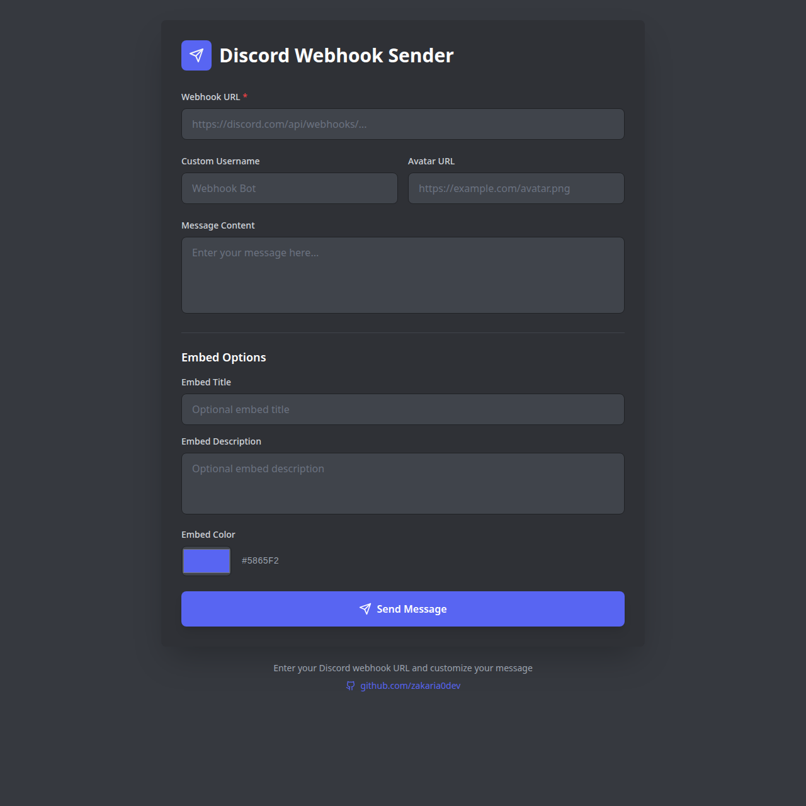

# Discord Webhook Sender

A modern, user-friendly web application for sending messages to Discord channels via webhooks.

## Features

- **Send Messages**: Easily send text messages to any Discord channel using a webhook URL.
- **Custom Embeds**: Create rich embeds with titles, descriptions, and custom colors.
- **Identity Customization**: Set a custom username and avatar URL for the webhook bot.
- **Real-time Preview**: See how your message will look before sending (implied by the clean UI).
- **Responsive Design**: precise and beautiful interface built with React and Tailwind CSS.

## Technologies Used

- React
- TypeScript
- Tailwind CSS
- Vite
- Lucide React (Icons)

## Getting Started

1. Clone the repository.
2. Install dependencies: `npm install`
3. Start the development server: `npm run dev`
4. Open `http://localhost:5173` in your browser.

## License

MIT
